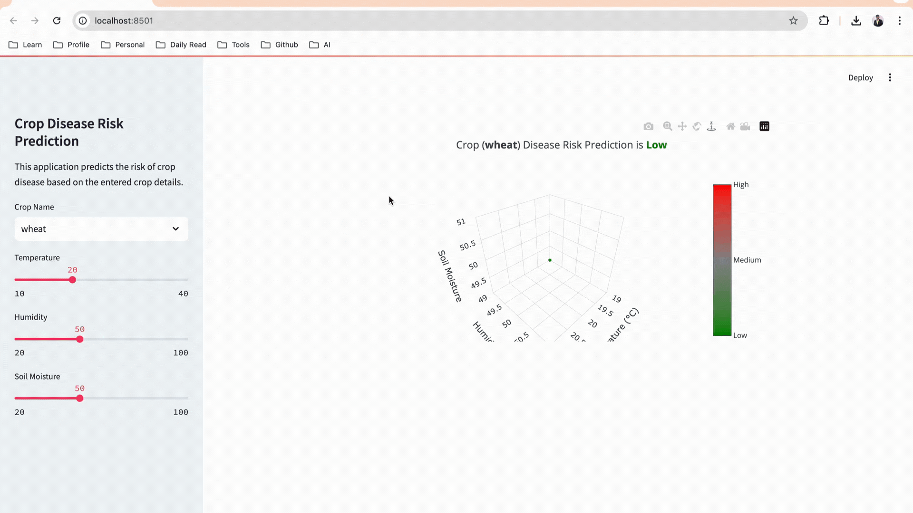

# 📦 Streamlit App

Streamlit is a powerful tool for creating interactive web applications using Python. However, there are times when the built-in components may not meet your specific needs. In such cases, you can create custom components using modern front-end technologies like Vite, React, and TypeScript. This guide will walk you through the process of setting up a custom component for your Streamlit app, enabling a seamless integration of sophisticated front-end features with the simplicity of Python.

## How to run locally

1. Make sure to install required python packages
   
```
pip install -r requirements.txt
```

2. Make sure to install all required npm packages in frontend project

```
cd streamlit-app/rbutton/frontend

npm install
```

3. If you want to run application dev mode update `.env` file

```
DEV_MODE=true

// this path is for your running frontend application
FRONTEND_HOST=http://localhost:5173
```

4. If you want to run production build

```
cd streamlit-app/rbutton/frontend

npm run build
```

## Demo App

[](https://app-app-jxe6thwxf43qfvabwmrrlk.streamlit.app/)


<p align="center">
  <a href="https://app-app-jxe6thwxf43qfvabwmrrlk.streamlit.app/">
     
  </a>
</p>

## Project Structure

````
streamlit-app/
├── streamlit_app.py
├── .env
├── requirements.txt
├── rbutton/
│   ├── __init__.py
│   ├── frontend/
│   │   ├── dist/
│   │   │   ├── index.html
│   │   │   ├── assets
│   │   │   │   ├── index.js
│   │   │   │   └── index.css
│   │   ├── src/
│   │   │   ├── App.tsx
│   │   │   ├── assets
│   │   │   │   └── ...
│   │   │   ├── components
│   │   │   │   └── ...
│   │   │   └── ...
│   │   ├── package.json
│   │   └── vite.config.ts
````


## Further Reading

- [30 Days of Streamlit](https://30days.streamlit.app/)
- [How to build your own Streamlit component](https://blog.streamlit.io/how-to-build-your-own-streamlit-component/)
- [Understanding Streamlit's client-server architecture](https://docs.streamlit.io/develop/concepts/architecture/architecture)
- [Wiki](https://github.com/streamlit/streamlit/wiki)


### Connect with me on
<div id="badges">
  <a href="https://twitter.com/shindesan2012">
    
  </a>
  <a href="https://www.linkedin.com/in/shindesantosh/">
    
  </a>
   <a href="https://blog.santoshshinde.com/">
    
  </a>
  <a href="https://www.buymeacoffee.com/santoshshin" target="_blank">
    
    </a>
</div>